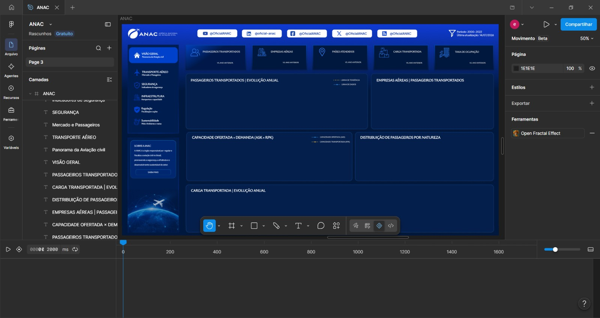
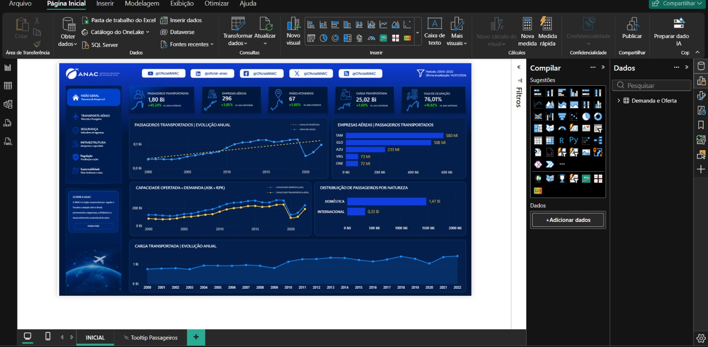
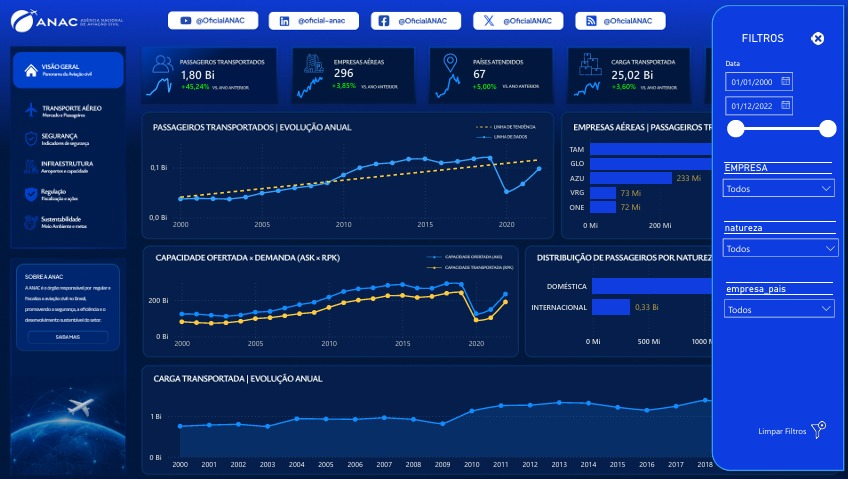
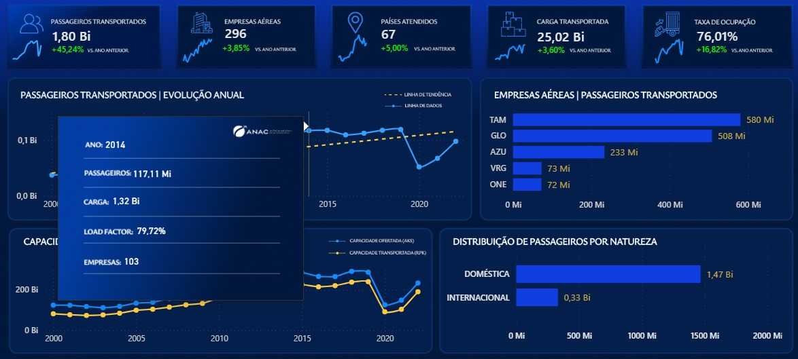
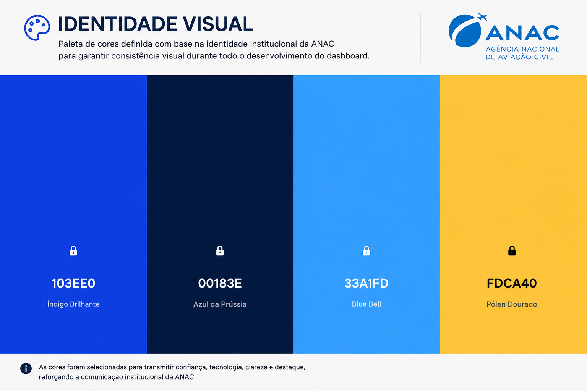

# ✈️ Dashboard Executivo | ANAC

  

> **Dashboard Executivo desenvolvido em Power BI utilizando dados públicos da Agência Nacional de Aviação Civil (ANAC) para analisar a evolução do transporte aéreo brasileiro entre 2000 e 2022.**

---

# 📌 Objetivo

Desenvolver um dashboard executivo capaz de transformar dados públicos em informações estratégicas, proporcionando uma visão clara sobre a evolução da aviação civil brasileira, seus principais indicadores e os impactos causados pela pandemia de COVID-19 no setor.

---

# 📊 Sobre o Projeto

Este projeto foi desenvolvido utilizando dados disponibilizados pelo **Portal de Dados Abertos da ANAC**.

Durante o desenvolvimento foram aplicadas técnicas de análise exploratória, tratamento de dados, modelagem e visualização para construir um dashboard interativo focado em indicadores executivos.

O projeto foi pensado para apresentar informações de forma intuitiva, permitindo que gestores e analistas possam identificar tendências, comparar indicadores e explorar os dados através de filtros e tooltips personalizados.

---

# 🛠️ Tecnologias Utilizadas

| Ferramenta | Utilização |
|------------|------------|
| 📊 Power BI | Desenvolvimento do Dashboard |
| ⚡ DAX | Criação das Medidas e KPIs |
| 🔄 Power Query | ETL e Transformação dos Dados |
| 🗄️ SQL | Análise Exploratória dos Dados |
| 🎨 Figma | Prototipação da Interface |

---

# 📈 Principais Indicadores

- 👥 Passageiros Transportados
- ✈️ Empresas Aéreas
- 🌍 Países Atendidos
- 📦 Carga Transportada
- 📊 Taxa de Ocupação
- 📉 Capacidade Ofertada (ASK)
- 📈 Demanda Transportada (RPK)

---

# 💡 Principais Insights

- Crescimento consistente da demanda entre 2000 e 2019.
- Forte impacto da pandemia de COVID-19 em 2020.
- Recuperação gradual do setor nos anos de 2021 e 2022.
- Predominância do mercado doméstico em relação ao internacional.
- TAM, GOL e AZUL lideram o transporte de passageiros durante o período analisado.

---

# ⚙️ Funcionalidades

✅ Dashboard totalmente interativo

✅ KPIs executivos

✅ Indicadores com variação percentual

✅ Tooltips personalizados

✅ Painel de filtros lateral

✅ Linha de tendência

✅ Comparativo entre ASK x RPK

✅ Layout desenvolvido no Figma

---

# 🚀 Processo de Desenvolvimento

O projeto foi desenvolvido seguindo todas as etapas de um fluxo de Business Intelligence.

---

## 🎨 1. Planejamento da Interface

Antes do desenvolvimento no Power BI foi criado um protótipo completo no Figma para definir:

- Estrutura do Dashboard
- Organização dos KPIs
- Paleta de Cores
- Navegação
- Experiência do Usuário (UX)

---

## 🗄️ 2. Exploração dos Dados

A etapa inicial consistiu na exploração dos dados utilizando SQL para compreender a estrutura da base e identificar possíveis inconsistências.

Principais atividades:

- Análise exploratória
- Validação das informações
- Identificação de padrões
- Consulta dos indicadores

---

## 🔄 3. Tratamento dos Dados

Após a exploração dos dados foi realizado o processo de ETL utilizando Power Query.

Foram realizadas atividades como:

- Limpeza dos dados
- Padronização
- Ajustes de tipos
- Tratamento de valores

---

## 📊 4. Desenvolvimento no Power BI

Nesta etapa foram desenvolvidos:

- KPIs Executivos
- Medidas em DAX
- Visualizações
- Modelagem
- Layout Final

---

## 🎛️ 5. Painel de Filtros

Foi desenvolvido um painel lateral para permitir análises dinâmicas por:

- 📅 Período
- ✈️ Empresa
- 🌎 Natureza do Voo
- 🌍 País

---

## 💬 6. Tooltips Personalizados

Foram criadas páginas de Tooltip com indicadores complementares para enriquecer a experiência do usuário durante a navegação.

---

## 🎨 7. Identidade Visual

Toda a identidade visual foi desenvolvida do zero buscando transmitir uma aparência moderna inspirada na comunicação visual da ANAC.

A paleta de cores foi definida visando melhorar a leitura dos indicadores e manter consistência visual em todo o dashboard.

---

# 📂 Fonte dos Dados

Os dados utilizados neste projeto foram obtidos através do Portal de Dados Abertos da Agência Nacional de Aviação Civil (ANAC).

🔗 https://www.gov.br/anac/pt-br/assuntos/dados-e-estatisticas/dados-abertos

---

# 👨‍💻 Autor

## Erick Amorim

Business Intelligence | Power BI | SQL | Data Analytics

🔗 **LinkedIn**

https://www.linkedin.com/in/erickkamorim

💻 **GitHub**

https://github.com/erickkamorim

---

⭐ Se este projeto foi interessante para você, considere deixar uma estrela no repositório.
